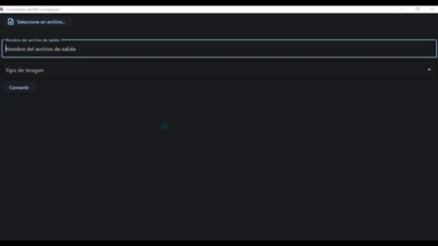

# Programa para convertir pdf 📃 a imagenes 🎞 facil, rapido, intuitivo 🥰😏🎉!!

## Installation

Instala pdf2image con PIP

```bash
  cd PDF_TO_IMG
  pip install pdf2image
  python main.py
```

## Requerimientos del aplicativo

**Lenguaje:** Python intaldo en el sistema

**Descargar Poppler:** https://github.com/oschwartz10612/poppler-windows/releases

**Configurar la variable de entorno:** C:\Python\poppler\Library\bin

## UI BY


